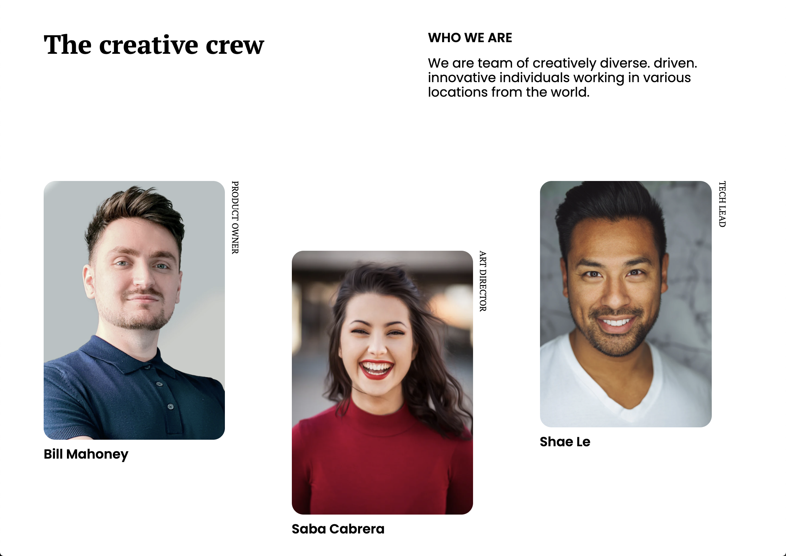

<h1 align="center">My team page</h1>

   Solution for a challenge from  <a href="http://devchallenges.io" target="_blank">DevChallenges.io</a>.

  <h3>
    <a href="https://egpereira-my-team-page.netlify.app/">
      Demo
    </a>
     | 
    <a href="https://devchallenges.io/solutions/ag5L7XArO2iM1QjJjBUE">
      Solution
    </a>
     | 
    <a href="https://devchallenges.io/challenges/hhmesazsqgKXrTkYkt0U">
      Challenge
    </a>
  </h3>

## Overview

In [this project](https://egpereira-my-team-page.netlify.app/) I had to replicate a simple team members page based on the given design. The major challenge was figuring out how to properly make the rotated text for the team member role.

Aiming to exercise building sites with accessibility in mind, I tried my best to use the correct HTML tags for each of the components and made some personal changes on the used colors to make sure they all reached the minimum contrast level of the [WCAG Contrast (Enhanced)](https://www.w3.org/WAI/WCAG21/Understanding/contrast-enhanced) success criterion.

The [WCAG Non-text Content](https://www.w3.org/WAI/WCAG21/Understanding/non-text-content.html) success criterion was also considered when adding alternative texts to all the images containing the name of the team member and its role.

### Built With

- HTML
- CSS
- [Sass](https://sass-lang.com/)
- [Netlify](https://www.netlify.com/)

## Features

This application/site was created as a submission to a [DevChallenges](https://devchallenges.io/challenges) challenge. The [challenge](https://devchallenges.io/challenges/hhmesazsqgKXrTkYkt0U) was to build an application to complete the given user stories.

**User story**: I can see a page following the given design

## Contact

- [GitHub](https://github.com/Egpereira)
- [Email](mailto:egpereira05@gmail.com)
